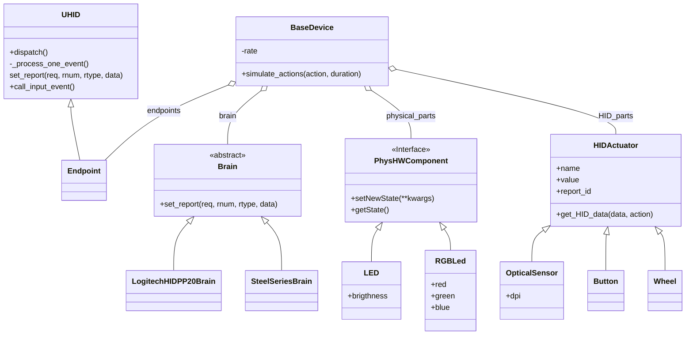
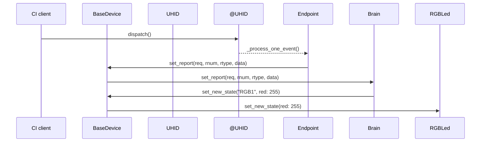
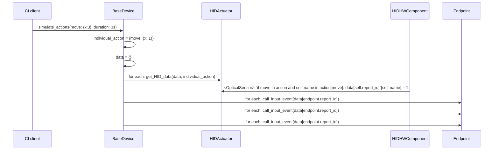

# class diagram

---

# Sequence diagram for `dispatch()`:

---

# Sequence diagram for `simulate_actions()` (refresh rate: 1Hz):

# Notes

- `Brain` can not inherit from `UHID` or `EndPoint`: it needs to process all endpoints in one place
- `rate` is global to `SimulatedDevice` because it's a parameter only used in `simulate_actions()`, and it doesn't really make sense to have a special class for it

